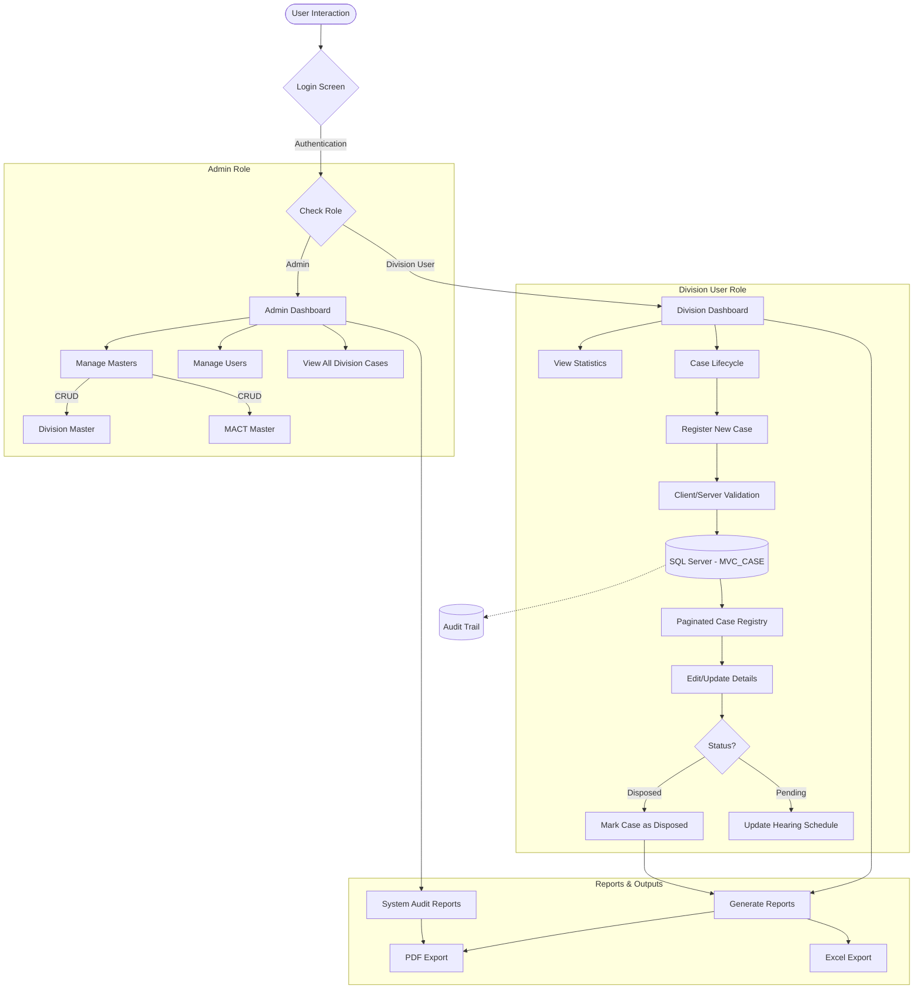

# Software Requirements Specification (SRS)
## Law Project - Case Management System

---

## 1. Introduction

### 1.1 Purpose
The purpose of this document is to specify the software requirements for the comprehensive **Case Management System (Law Project)**. This web-based system is designed to securely record, track, and manage legal cases across multiple domains (MVC/MACT, Gratuity, and Labour) at the Division level, entirely replacing legacy Excel-based registers.

### 1.2 Document Conventions
- **MVC**: Motor Vehicle Claims
- **MACT**: Motor Accident Claims Tribunal
- **EP**: Execution Petition
- **MFA**: Miscellaneous First Appeal
- **SLP**: Special Leave Petition
- **UI**: User Interface
- **DB**: Database

### 1.3 Intended Audience
This document is intended for:
- **Developers & Engineers**: To understand the system architecture, modules, and database structure.
- **QA & Testers**: For formulating test cases and validating functionality.
- **Stakeholders & Management**: For verifying that the software aligns with Government-approved tracking directives.

### 1.4 Product Scope
The **Case Management System** digitizes entirely the workflow handling for diverse transport/corporate legal claims. It includes:
1. **MVC/MACT Claims**: High Court Appeals, Execution Petitions, and Supreme Court tracking.
2. **Gratuity Cases**: Appellate Authority tracking, Controlling Authority directives, Payments, and Delays.
3. **Labour Cases**: Writ Petitions, Employee details, Depot-level allocations, and Disciplinary proceedings.
4. **Master Directories**: Repositories for Division codes, Courts/MACTs, Advocates, Case Statuses, and System Users.
5. **Role-Based Workflows**: Tailored, isolated views for Admins, Division Users, and the Central/Head Office.

---

## 2. Overall Description

### 2.1 Product Perspective
The system operates as a monolithic **ASP.NET Core MVC (net9.0)** application deployed on a centralized server using **SQL Server** as the persistent storage layer. It serves remote corporate divisions through a standard web-browser interface, ensuring concurrent, multi-user accessibility.

### 2.2 Product Functions
- **Unified Dashboard**: Real-time aggregated statistics categorized by Case Types and Status.
- **Case Lifecycle Management**: End-to-end registration, hearing scheduling, disposal updating, and appellant tracking.
- **Bi-lingual Interface**: Complete Kannada/English localizations aligning with regional government standards.
- **Automated Reporting**: On-the-fly PDF and Excel generation.
- **Audit Tracking**: Comprehensive and immutable audit logs capturing creation and modification of records.

### 2.3 User Classes and Characteristics
1. **Admin**: Responsible for creating users, handling Master Data CRUD operations, and performing system-wide audits.
2. **Division User**: Resource-scoped users tied to a specific `DivisionID`. Only authorized to create/edit cases and track lifecycles for their specific jurisdiction.
3. **Central Office (Head Office)**: Read-only cross-divisional access with specialized capabilities to process High Court/Supreme Court Appeals without altering baseline division records.

### 2.4 Operating Environment
- **Platform**: ASP.NET Core 9.0
- **Database**: Microsoft SQL Server
- **Client**: Any modern web browser (Edge, Chrome, Firefox, Safari)

### 2.5 System Workflow

---

## 3. External Interface Requirements

### 3.1 User Interfaces
- Forms and dashboards shall utilize **HTML5, CSS3, and Bootstrap 5** for responsiveness.
- The interface shall feature glass-morphism panels, interactive data tables (DataTables plugin), and bilingual labels.
- Flash messages and modal dialogues shall handle transient state alerts.

### 3.2 Hardware Interfaces
- The web application executes on a standard Windows Server (IIS) environment. No direct hardware integration (e.g., biometric scanners) is utilized presently.

### 3.3 Software Interfaces
- **Entity Framework Core / ADO.NET**: For ORM and stored procedure execution bridging logic and SQL Server.
- **ASP.NET Core Identity**: Managing Claim-based Security and Cookie-based authentication.

---

## 4. System Features

### 4.1 Authentication & Authorization
**Description:** Ensures that only verified personnel access the system, scoped to their explicit permissions.
**Functional Requirements:**
- Secure Cookie-based authentication using `ClaimsPrincipal`.
- Cryptographic PBKDF2 password hashing.
- Role-based gating mapping to `Admin`, `Division`, and `CentralOffice` identities.

### 4.2 MVC / MACT Management
**Description:** Replaces physical MACT directories with a searchable database.
**Functional Requirements:**
- **Registration**: Capture MVC Number, Court MACT ID, Vehicle No, Accident Date, and Claim Amount.
- **Adverse Details**: File alleged accidents and private hired statuses along with TR18/objection uploads.
- **Execution Petitions (EP)**: Parallel tracking tied directly to disposed MVC claims.
- **Appeals**: Extension table recording High Court/Supreme Court (Claimant and Corp) MFA/SLP details with corresponding stay grants or interim compensations.

### 4.3 Gratuity Case Management
**Description:** Tracks gratuity-related worker compensation disputes.
**Functional Requirements:**
- Record Controlling Authority and Appellate Authority directives.
- Log deposit sums, compliance statuses, delay remarks, and payment modes.
- Support file upload capabilities for specific orders.

### 4.4 Labour Case Management
**Description:** Detailed dispute and disciplinary tracking for corporate employees.
**Functional Requirements:**
- Form definitions for registering Disciplinary constraints linked natively to `Depot` associations.
- Handle Execution Petitions tailored explicitly to Labour parameters.
- Provide contextual hiding logic for 'Pending for Filing' checks to mirror user-dependent workflow progress.

### 4.5 Data & Audit Management
**Description:** Retains system integrity and data traceability.
**Functional Requirements:**
- **Master Tables**: UI/CRUD tools for dynamic administration of `DIVISION_MASTER`, `DEPOT_MASTER`, `MACT_MASTER`, `ADVOCATE_MASTER`, and `CASE_STATUS_MASTER`.
- **Audit Logs**: Maintain an untampered sequential history of what was modified, preserving both `OldValue` and `NewValue` mapped to timestamps and `UserID`s.

---

## 5. Other Nonfunctional Requirements

### 5.1 Performance Requirements
- Server-side Pagination implementation combining `OFFSET` and `FETCH NEXT` to ensure sub-second response times even when directories scale past 50,000 cases.
- Aggregation workflows heavily lean on optimized database-side Stored Procedures (e.g., `sp_GetDashboardStats`) rather than inefficient application memory calculations.

### 5.2 Security Requirements
- Parameterized ADO.NET strings and strictly typed EF Core LINQ to prevent SQL Injections.
- Transport-layer hardening utilizing HSTS and mandatory HTTPS Redirection to thwart Man-in-the-Middle payloads.
- Environment-sensitive compilation hiding stack traces outside of the isolated `Development` phase.

### 5.3 Reliability & Availability
- Database design employs absolute Foreign Key (FK) constraints, neutralizing unlinked or orphaned records.
- Standardized `IsActive` bit fields to simulate logical soft-deletes over destructive hard-deletes.

### 5.4 Maintainability
- Monolithic layered architecture utilizing strict `Controller` -> `Repository` -> `Database` separation of concerns.
- Global ViewModel validations `[Required]`, `[StringLength]` directly aligning with physical Data Type definitions in SQL.
